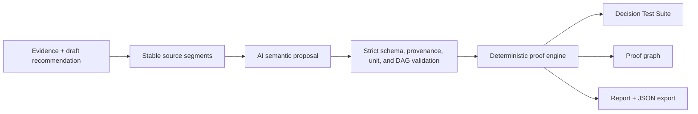

# Decispec

**Turn AI recommendations into tests.**

AI writes the recommendation. Decispec runs the tests.

[Live application](https://decispec.vercel.app) · [Repository](https://github.com/UMBR-A/decispec)

Decispec compiles an AI-written recommendation and its evidence into an executable decision specification. It binds material claims to exact source passages, recalculates structured operations, checks units and policy constraints, propagates failures through a proof graph, and reports whether the conclusion follows from the declared inputs.

Decispec does not guarantee that a decision is universally correct. It verifies a narrower question: does this recommendation follow from the represented evidence, assumptions, calculations, dependencies, and selection rule?

## The problem

AI can produce polished recommendations that still mix billing periods, omit recurring costs, rely on unsupported assumptions, or carry broken totals into the conclusion. Conventional document workflows hide the evidence-to-conclusion chain inside prose.

Decispec is for teams reviewing consequential recommendations in procurement, finance, operations, policy, compliance, and technical governance.

## What Decispec does differently

- **Exact evidence binding:** material claims point to source passages, not free-form citations.
- **Executable calculations:** derived values use typed operations; arbitrary code and `eval` are forbidden.
- **Unit-aware verification:** currency, quantity, duration, rate, percentage, and recommendation units are checked deterministically.
- **Proof DAG:** calculation and policy dependencies are evaluated in topological order.
- **Failure propagation:** a broken input visibly invalidates dependent claims, totals, and recommendations.
- **Source-bound correction:** corrections change executable operations, rematerialize dependencies, and recompute downstream results without rewriting evidence.
- **Deterministic selection:** candidate totals and policy constraints drive the result; the model cannot assert a winner.
- **Auditable artifacts:** reports and JSON exports use the same evaluated graph shown in the workspace.

## Primary workflow

1. Paste or upload source documents.
2. Paste or upload an AI-written recommendation.
3. Select **Test decision** to begin analysis.
4. Inspect exact evidence, calculations, assumptions, and the dependency graph.
5. Review any broken path and proposed correction.
6. Apply the correction and inspect the recomputed recommendation.
7. View, print, or export the proof report.

## How it works



1. TXT or text-based PDF evidence is normalized into bounded documents and stable paragraph, sentence, clause, and numeric-evidence segments.
2. The provider proposes source bindings, claims, structured calculations, dependencies, assumptions, corrections, and a typed candidate selector.
3. Strict schemas and local validators reject unknown or discontinuous segments, unsupported values, invalid units, unknown dependencies, cycles, malformed calculations, and non-executable recommendations.
4. Source-bound values and units are recovered locally from exact evidence. Derived values come only from structured operations.
5. The local engine materializes calculation dependencies, evaluates the DAG, checks dimensions, propagates failures, applies atomic corrections, and selects the eligible candidate.
6. The workspace, report, and exported proof graph all render the same evaluated state.

The provider is a proposal boundary, not an authority boundary. It cannot authoritatively set claim status, arithmetic, integrity, diffs, or the final winner.

See [the architecture document](docs/ARCHITECTURE.md) and [technical submission summary](submission/technical-summary.md) for more detail.

## Architecture and technology

- **Application:** Next.js 16, React 19, TypeScript
- **Proof visualization:** React Flow
- **Interaction:** Framer Motion and Lucide icons
- **Validation:** Zod strict schemas plus provenance and DAG validators
- **Documents:** `unpdf` for server-side text extraction
- **Provider:** OpenAI Responses API through a server-only boundary
- **Testing:** Vitest, Testing Library, and Playwright
- **Deployment:** Vercel-native Next.js production build
- **Alternate build:** Vinext/Vite with Cloudflare-compatible output

## Local setup

Requires Node.js 22.13 or newer.

```bash
git clone https://github.com/UMBR-A/decispec.git
cd decispec
npm ci
cp .env.example .env.local
npm run dev
```

Set the live provider values in ignored `.env.local`. Never expose the key through a `NEXT_PUBLIC_` or `VITE_` variable.

```dotenv
OPENAI_API_KEY=your-project-key
OPENAI_PROVIDER=openai
OPENAI_MODEL=gpt-5.6
```

Open [http://localhost:3000](http://localhost:3000), select **Analyze my decision**, and confirm the preflight checks before uploading evidence. The provider is called only after **Test decision** is pressed.

## Scripts

| Command | Purpose |
| --- | --- |
| `npm run dev` | Start the Vinext development server |
| `npm run typecheck` | Run TypeScript without emitting files |
| `npm run lint` | Run ESLint |
| `npm test` | Run unit, component, provider, route, replay, and export tests |
| `npm run test:e2e` | Run the Playwright browser suite |
| `npm run build` | Build the Vinext/Cloudflare-compatible target |
| `npm run build:vercel` | Build the native Next.js Vercel target |
| `npm run verify` | Run typecheck, lint, tests, and Vinext build |

The paid live smoke test is separately gated by `ASSERT_LIVE_SMOKE=1` and is not part of ordinary verification.

## Security and privacy

- `OPENAI_API_KEY` is read only on the server and is never returned to the browser.
- Uploaded documents and draft memos are untrusted evidence, never instructions.
- Requests use `store: false`, no tools, no conversation linkage, and zero automatic retries.
- Safe diagnostics contain only stable codes and non-content metadata.
- Raw provider output, prompts, quotations, secrets, and raw provider errors are excluded from client diagnostics.
- Inputs are bounded, and image-only PDFs are rejected because OCR is not implemented.

## Limitations

- Decispec verifies represented evidence and rules; it does not discover every missing fact or guarantee real-world correctness.
- Semantic proposals can be rejected and require human review.
- The calculation and unit vocabulary is deliberately narrow.
- OCR, image understanding, spreadsheets, and scanned PDFs are not supported.
- Evidence completeness, policy interpretation, and undeclared assumptions remain human responsibilities.

## License

Decispec is available under the [MIT License](LICENSE). Copyright © 2026 Decispec contributors.

## Submission resources

- [Project description](submission/project-description.md)
- [Judging notes](submission/judging-notes.md)
- [Technical summary](submission/technical-summary.md)
- [Screenshot plan](submission/screenshot-plan.md)
- [Video shot list](submission/video-shot-list.md)
