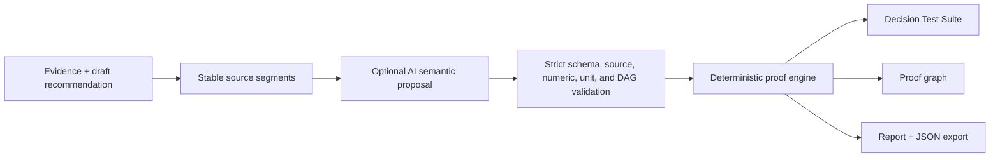
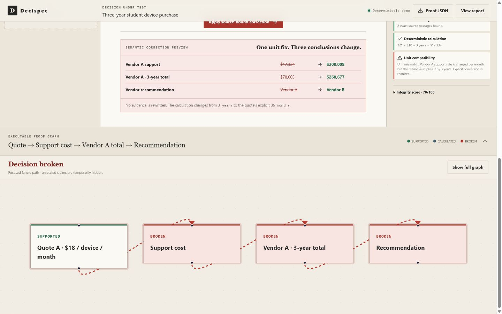
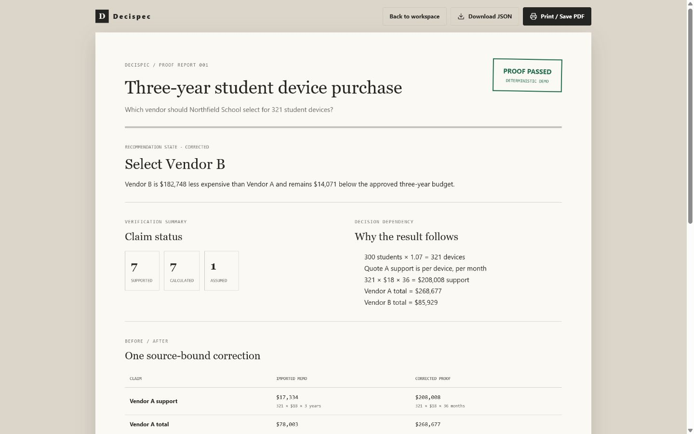

# Decispec

**Turn AI recommendations into tests.**

AI writes the recommendation. Decispec runs the tests.

[Live demo](https://decispec.vercel.app) · [Repository](https://github.com/UMBR-A/decispec) · [Demo script](submission/demo-script.md)

Decispec compiles an AI-written recommendation and its evidence into an executable decision specification. It binds material claims to exact source passages, recalculates structured operations, checks units and policy constraints, propagates failures through a proof graph, and reports whether the conclusion follows from the declared inputs.

Decispec does not guarantee that a decision is universally correct. It verifies a narrower, useful question: does this recommendation follow from the evidence, assumptions, calculations, dependencies, and selection rule represented in the proof?

## The problem

AI can produce a polished recommendation that cites the right documents while still mixing monthly and annual rates, omitting a recurring cost, relying on an unsupported assumption, or carrying a broken total into the final conclusion. Conventional chat and document-summary workflows make these errors difficult to inspect because the evidence-to-conclusion chain remains prose.

Decispec is designed for people who must review consequential recommendations—procurement, finance, operations, policy, compliance, and technical teams—before acting on them.

## What Decispec does differently

- **Exact evidence binding:** material claims point to exact source passages rather than free-form citations.
- **Executable calculations:** derived values use a small set of typed operations; arbitrary expressions, generated code, and `eval` are not allowed.
- **Unit-aware verification:** currency, device, month, year, rate, percentage, and recommendation units are checked deterministically.
- **Proof DAG:** calculation and policy dependencies form an acyclic graph evaluated in topological order.
- **Failure propagation:** a broken input visibly invalidates every dependent claim, total, and recommendation.
- **Source-bound correction:** a correction changes the executable operation, not the evidence, then rematerializes dependencies and recomputes downstream values.
- **Deterministic selection:** eligible candidate totals and policy ceilings drive the winner; the model cannot simply assert one.
- **Auditable artifacts:** the corrected proof can be printed and exported as JSON with evaluated graph statuses, values, sources, assumptions, and report state.

## Try the deterministic demonstration

Open the [live demo](https://decispec.vercel.app) and choose **Instant demonstration**. It is a bundled synthetic school-device decision and requires no API key or network provider.

The imported memo recommends Vendor A. The quote states that support costs **$18 per device per month** for 36 months, but the memo multiplies the monthly rate by three years without an explicit conversion. The arithmetic produces `$17,334`; the dimensions do not produce a valid three-year support cost.

Decispec exposes the load-bearing path:

```text
Quote A → Support cost → Vendor A total → Recommendation
```

After the user applies the source-bound correction, the engine recomputes:

| Result | Verified value |
| --- | ---: |
| Vendor A support cost | `$208,008` |
| Vendor A total | `$268,677` |
| Vendor B total | `$85,929` |
| Vendor B advantage | `$182,748` |
| Final recommendation | **Vendor B** |

The demonstration supports correction preview, focused and full graph views, undo/replay, a printable report, and proof JSON export.

## How it works



1. TXT or text-based PDF evidence is normalized into bounded documents and stable paragraph, sentence, clause, and numeric-evidence segments.
2. In optional live mode, GPT proposes source bindings, claims, structured calculations, dependencies, assumptions, corrections, and a typed candidate selector.
3. Strict Zod schemas and local validators reject unknown or discontinuous segments, unsupported values, invalid units, unknown dependencies, cycles, malformed calculations, and non-executable recommendations.
4. Provider-authored source values and units are replaced with values recovered locally from bound evidence. Derived values are produced only by structured operations.
5. The local engine materializes calculation dependencies, evaluates the DAG, checks dimensions, propagates failures, applies atomic corrections, and selects the eligible minimum-cost candidate.
6. The UI renders the same evaluated state used by the report and exported proof graph.

The provider is a proposal boundary, not an authority boundary. It cannot authoritatively set claim status, arithmetic, integrity, diffs, or the final winner.

See [the architecture document](docs/ARCHITECTURE.md) and [technical submission summary](submission/technical-summary.md) for more detail.

## Two honest operating modes

### Deterministic demonstration

- Uses bundled synthetic evidence and a fixed decision graph.
- Makes no OpenAI API request.
- Requires no environment variables.
- Is always labeled as a deterministic demo.

### Optional live analysis

- Runs only after the user explicitly presses **Test decision**.
- Accepts pasted evidence, TXT files, and text-based PDFs.
- Uses a server-only OpenAI Responses API provider to propose semantic structure.
- Validates and executes the result locally before returning evaluated state.
- Returns a safe configuration error when `OPENAI_API_KEY` is absent.
- Never substitutes the deterministic fixture when live analysis fails.

The public deployment intentionally has no OpenAI key configured, so the deterministic demonstration is the judge-ready path and live mode reports that analysis is unavailable.

## Architecture and technology

- **Application:** Next.js 16, React 19, TypeScript
- **Proof visualization:** React Flow
- **Interaction:** Framer Motion, Lucide icons
- **Validation:** Zod strict structured schemas and custom provenance/DAG validators
- **Documents:** `unpdf` for server-side text extraction
- **Optional provider:** OpenAI Responses API through the server-only OpenAI SDK
- **Testing:** Vitest, Testing Library, Playwright
- **Deployment:** Vercel-native Next.js production build
- **Alternate build path:** Vinext/Vite with Cloudflare-compatible output retained for portability

The repository includes 125 active unit, component, provider, route, replay, export, and metadata tests plus six browser end-to-end scenarios.

## Local setup

Requires Node.js 22.13 or newer.

```bash
git clone https://github.com/UMBR-A/decispec.git
cd decispec
npm ci
npm run dev
```

Open [http://localhost:3000](http://localhost:3000), then use **Instant demonstration**. No environment file is needed for that path.

To develop the optional live provider locally, copy `.env.example` to `.env.local` and set `OPENAI_API_KEY` there. `.env.local` is ignored by Git. Never expose the key through a `NEXT_PUBLIC_` variable.

## Scripts

| Command | Purpose |
| --- | --- |
| `npm run dev` | Start the Vinext development server |
| `npm run typecheck` | Run TypeScript without emitting files |
| `npm run lint` | Run ESLint |
| `npm test` | Run unit, component, provider, route, replay, and export tests |
| `npm run test:e2e` | Run the Playwright browser suite |
| `npm run build` | Build the Vinext/Cloudflare-compatible target |
| `npm run build:vercel` | Build the native Next.js Vercel target |
| `npm run verify` | Run typecheck, lint, tests, and Vinext build |

The paid live smoke test is separately gated by `ASSERT_LIVE_SMOKE=1` and is not part of ordinary verification.

## Testing and validation

The test strategy covers:

- arithmetic, dimensional compatibility, topological evaluation, cycles, and unknown dependencies;
- source-segment binding, exact quotation materialization, numeric/unit provenance, and prompt-injection resistance;
- strict Structured Output fields, malformed output, refusals, timeouts, safe errors, and server-only secret behavior;
- candidate selection, policy eligibility, ties, corrections, dependency materialization, undo, and replay;
- pre-verification, broken, and corrected report/export agreement with no stale statuses;
- deterministic and captured provider replays with randomized provider IDs and ordering;
- responsive desktop/mobile flows, keyboard focus, reduced motion, mocked live analysis, and TXT/PDF extraction.

The deployed baseline passed TypeScript, ESLint, all active tests, both production builds, six Playwright flows, direct-route checks, metadata checks, and public secret/source-map scans.

## Security and privacy

- `OPENAI_API_KEY` is read only on the server and is never returned to the browser.
- Uploaded documents and draft memos are treated as untrusted evidence, never instructions.
- The live request uses `store: false`, no tools, no conversation linkage, and zero automatic retries.
- Safe diagnostics contain only validation stage, stable code, schema path or safe ID, counts/booleans, request ID, latency, and aggregate token usage.
- Raw provider output, prompts, quotations, secrets, and raw provider errors are excluded from client diagnostics.
- Files are bounded to eight documents, 10 MB each, and text limits. Scanned PDFs are rejected honestly because OCR is not implemented.

## Deployment

The production site is deployed on Vercel from `main` at [https://decispec.vercel.app](https://decispec.vercel.app). The canonical and social metadata use the public production hostname. The deterministic demonstration has no hosted secret dependency.

## Limitations

- Decispec verifies the represented evidence and rules; it does not discover every missing fact or guarantee real-world correctness.
- Live semantic proposals can be rejected and still require human review.
- The calculation and unit vocabulary is deliberately narrow rather than a general-purpose programming language.
- OCR, image understanding, spreadsheets, and scanned PDFs are not supported.
- Evidence quality, document completeness, policy interpretation, and undeclared assumptions remain human responsibilities.
- The public deployment does not currently configure live OpenAI analysis.

## Roadmap

- Add OCR and structured spreadsheet evidence with the same provenance boundary.
- Expand typed policy, time, currency, and eligibility operations without permitting arbitrary code.
- Add durable decision versions, reviewer comments, approvals, and signed proof artifacts.
- Build domain-specific evaluation sets and adversarial regression suites.
- Support enterprise evidence connectors and configurable retention controls.

## License

Decispec is available under the [MIT License](LICENSE). Copyright © 2026 Decispec contributors.

## Submission resources

- [Project description](submission/project-description.md)
- [Demo scripts](submission/demo-script.md)
- [Judging notes](submission/judging-notes.md)
- [Technical summary](submission/technical-summary.md)
- [Screenshot plan](submission/screenshot-plan.md)
- [Video shot list](submission/video-shot-list.md)




