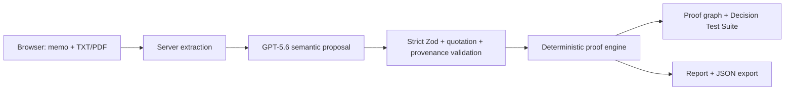

# Decispec

**Turn AI recommendations into tests.**

> AI writes the recommendation. Decispec runs the tests.

## Problem and solution

A polished recommendation can cite the right document and still misuse a billing period, omit a recurring charge, or depend on a broken total. Document summarizers explain what text says; Decispec compiles AI-generated recommendations into executable decision specifications. GPT identifies claims and relationships, while exact source evidence and deterministic code control quotations, numbers, units, dependencies, calculations, corrections, and the final recommendation.

Decispec does not claim universal truth. It verifies the declared evidence, calculations, units, dependencies, assumptions, and selection rule.

## Two honest modes

- **Instant demonstration** loads the bundled school-device fixture. It makes no API request and is always labeled deterministic.
- **Analyze my decision** sends user-supplied evidence and a draft memo to a server-only GPT-5.6 provider only after **Test decision** is pressed. A failed live analysis returns a safe error; it never substitutes the demo.

TXT and text-based PDF files are extracted on the server. PDF page boundaries are retained in normalized content. Encrypted, malformed, empty, and image-only PDFs are rejected; OCR is not claimed or performed.

## Architecture and trust boundary



GPT may propose exact source spans, fact/policy nodes, structured calculations, dependencies, assumptions, corrections, and a typed candidate selector. It cannot authoritatively set statuses, arithmetic results, integrity, diffs, or the winner. Provider statuses are reset locally. The engine accepts only enumerated operations; generated code, `eval`, arbitrary expressions, and tool use are forbidden.

Security details and a larger diagram are in [docs/ARCHITECTURE.md](docs/ARCHITECTURE.md).

## Bundled proof

The imported memo treats a rate quoted at **$18 per device per month** as though three annual multipliers were valid. The local engine breaks support cost, Vendor A total, and the Vendor A recommendation. An explicit correction recomputes:

- Vendor A support: $208,008
- Vendor A total: $268,677
- Vendor B total: $85,929
- deterministic recommendation: Vendor B

The focused graph exposes `Quote A → Support cost → Vendor A total → Recommendation`, and **Show full graph** restores the complete DAG.

## Setup

Requires Node.js 22.13 or newer.

```bash
npm ci
copy .env.example .env.local
# add OPENAI_API_KEY only to .env.local
npm run dev
```

Open [http://localhost:3000](http://localhost:3000). The deterministic demonstration needs no key. `.env.local` is ignored by git; the key is read only by the server provider.

## Verification

```bash
npm run typecheck
npm run lint
npm test
npm run build
npx playwright install chromium  # first machine only
npm run test:e2e
```

`npm run verify` runs typecheck, lint, unit/component/provider/route tests, and the production build. The browser suite covers the deterministic hero flow, focused/full graph, correction/report, mocked live analysis, real TXT/PDF extraction, desktop, and mobile overflow.

The paid smoke test is deliberately opt-in and must never be run casually:

```bash
$env:ASSERT_LIVE_SMOKE='1'
npx vitest run tests/live-analysis-smoke.test.ts
```

## Routes

- `/` — product thesis and mode choice
- `/workspace/demo` — deterministic hero decision
- `/workspace/live` — explicit live analysis
- `/report/demo` — printable proof report and proof JSON
- `/api/documents/extract` — bounded server-side TXT/PDF extraction
- `/api/analyze` — server-only provider, strict validation, and deterministic evaluation

## Security model

- `OPENAI_API_KEY` never enters client code, responses, screenshots, or diagnostics.
- Uploaded documents and memo text are untrusted evidence, never instructions.
- Exact quotations are recovered conservatively; zero or ambiguous matches are rejected.
- Numeric evidence must be recoverable from its bound quotation with explicit unit-aware equivalence.
- Safe diagnostics contain only stage, stable code, schema path/ID, counts/booleans, request ID, latency, and token usage.
- Requests use `store:false`, no tools, no linked conversation, and zero automatic retries.

## Codex and GPT-5.6

Codex was used to implement, test, inspect, and document the product. GPT-5.6 Terra is restricted to semantic analysis in live mode. The deterministic TypeScript engine remains authoritative after every provider response.

## Limitations

- OCR and binary/image understanding are not implemented; scanned PDFs return an honest error.
- Semantic proposals still require review even after strict validation.
- ASSERT remains the internal development codename in historical records, validation codes, and gated environment-variable names. The public product name is Decispec.
- Nothing in this workspace has been deployed, committed, pushed, or published by the overnight run.

## Demo and submission

- [Demo script](docs/DEMO_SCRIPT.md)
- [Submission checklist](docs/SUBMISSION_CHECKLIST.md)
- [Overnight verification report](docs/OVERNIGHT_RUN.md)


