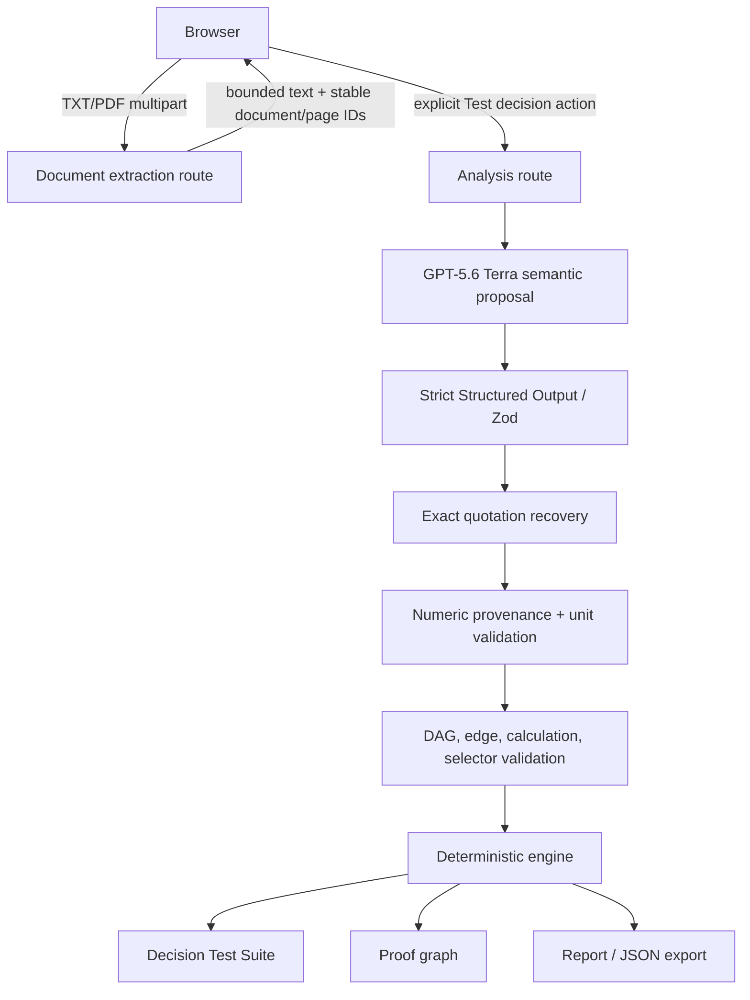

# Decispec Architecture

Decispec compiles AI-generated recommendations into executable decision specifications. GPT identifies claims and relationships; exact source evidence and deterministic code remain authoritative for every evaluated result.

## System flow

## Trust boundaries

The browser never receives `OPENAI_API_KEY`. It sends normalized user evidence to server routes and receives either validated analysis plus local evaluation, or content-safe error metadata.

Documents and draft memos are untrusted data. The provider system instructions explicitly ignore commands inside them. They cannot change the schema, model, tools, storage, retry, or security behavior.

GPT proposes semantic structure only. All provider node statuses and evaluated values are discarded/reset. The deterministic engine is the sole authority for arithmetic, unit compatibility, topological order, dependency propagation, corrections, diffs, policy eligibility, candidate selection, integrity, and report state.

## Provider contract

Every Structured Output property is required. Absence is represented with `null`, including source-span emphasis, node values for calculated nodes, and unresolved tie results. Recommendations use a typed `select-candidate` operation whose numeric totals and policy ceilings reference declared dependency nodes. The engine selects the winner.

Exact quotation validation first requires a substring. If that fails, punctuation, line endings, and repeated whitespace are canonicalized only for matching. Exactly one match is recovered back to the original document substring; zero and ambiguous matches are rejected.

## Document path

TXT is decoded as UTF-8. PDF text is extracted server-side with `unpdf`, page by page. Stable IDs combine a filename slug with a SHA-256 content prefix. Limits are 8 documents, 10 MB per file, 120,000 extracted characters per document, and 320,000 combined characters with the memo. OCR is unavailable and never implied.

## Errors and observability

Diagnostics may expose only stage, stable code, safe JSON path or ID, counts/booleans, request ID, latency, and aggregate usage. Quotations, source text, prompts, raw provider output/errors, and secrets are excluded. Request metadata is captured before local validation so it survives later rejection.
