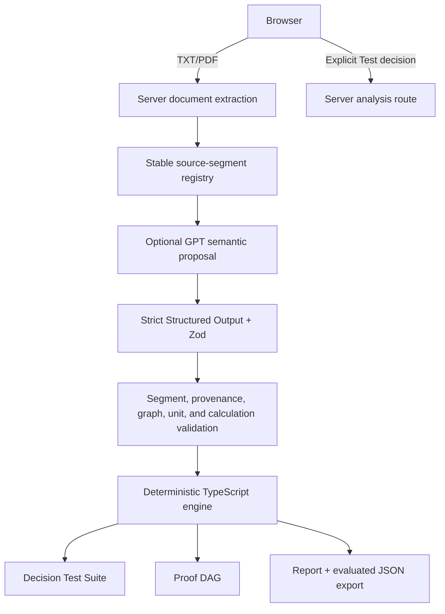

# Decispec Technical Summary

## Architecture

Decispec separates semantic compilation from authoritative evaluation.



The bundled demonstration enters at the deterministic engine with a synthetic, schema-validated fixture. It does not call the provider. Optional live mode enters through server extraction and the provider boundary, then must pass every local validation stage before execution.

## Proof DAG

The decision graph contains typed claim nodes—fact, policy, calculation, comparison, assumption, and recommendation—and typed dependency edges. Calculation specifications reference operands by node ID. Local dependency materialization converts those references into `calculation-input` edges and converts selector policy references into typed policy edges.

Before evaluation, the engine:

1. validates node and edge references;
2. deduplicates relationships;
3. materializes missing executable dependencies;
4. rejects self-edges and unknown operands;
5. topologically sorts the graph; and
6. rejects cycles.

Evaluation proceeds in topological order. Source-bound facts become supported, executable nodes become calculated, explicit assumptions remain assumed, and invalid nodes become broken. A broken dependency propagates to downstream claims, totals, and the recommendation.

## Evidence model

Documents are segmented deterministically into paragraphs, sentences, clauses, and numeric-evidence atoms. Segment IDs combine document identity, segment type, ordinal, and a stable content hash. The provider references IDs only; it does not author quotations, offsets, or page labels.

Local materialization restores each binding from the source registry. Multi-segment textual bindings must be adjacent, ordered, and from one document. Numeric facts must reference a numeric-evidence atom. Source text remains authoritative even if a provider proposes a conflicting value or unit.

TXT files are decoded as UTF-8. Text-based PDFs are extracted page by page with `unpdf`; page labels are preserved in normalized content. Limits are eight files, 10 MB per file, and 120,000 extracted characters per document. Empty, encrypted, malformed, duplicate, image-only, and oversized inputs fail safely. OCR is not implemented.

## Calculation validation

Decispec accepts only enumerated structured operations, including addition, subtraction, multiplication, division, percentage adjustment, explicit duration conversion, the bundled lower-total comparison, and the live provider’s typed candidate selector. Arbitrary expressions, generated code, `eval`, and provider tools are forbidden.

Each numeric node declares a canonical unit. The engine models currency, devices, and time dimensions, including month/year time bases. It validates additive compatibility and derives multiplicative dimensions from operands. A monthly recurring rate multiplied by a year operand fails because time bases differ unless a typed conversion is explicit.

Source-bound numbers are recovered locally. Currency formatting and commas normalize conservatively. Percentages allow only explicit equivalent forms such as source `7%` with percent value `7`, or ratio value `0.07`. A direct value of `1.07` is not accepted as source evidence; it must result from a structured percentage adjustment.

## Recommendation contract

The live provider represents a recommendation as `select-candidate` with:

- explicit candidate labels;
- numeric candidate-total node references;
- policy maximum node references;
- minimum selection direction; and
- an explicit tie result or unresolved tie.

The provider sets the recommendation value to `null`. Local code evaluates eligibility, compares executable totals, resolves or rejects ties, and produces the authoritative winner. An asserted vendor string without executable support is rejected.

## Dependency propagation

The engine evaluates a node only after its dependencies. A unit mismatch may still retain the arithmetic value for inspection, but the node status becomes broken. Any downstream node whose conclusion depends on that broken node also becomes broken. The demo’s path is:

```text
Vendor A monthly support rate
  → Vendor A support cost
  → Vendor A three-year total
  → Recommendation
```

The focused graph renders those four nodes while temporarily hiding unrelated claims. The complete graph remains available.

## Correction workflow

A correction identifies a target calculation and a replacement structured operation. Application is atomic:

1. verify the target and all replacement operands;
2. reject missing operands and self-dependencies;
3. remove obsolete calculation-input edges;
4. materialize replacement dependencies;
5. verify that no cycle was introduced; and
6. reevaluate the graph.

In the demonstration, the replacement operation uses the quote’s explicit 36-month term. Evidence is unchanged. The corrected graph produces `$208,008` support, `$268,677` for Vendor A, `$85,929` for Vendor B, and a Vendor B recommendation.

## Semantic differences, replay, and undo

The semantic diff compares evaluated nodes by value and status. The UI presents only the material changes in the demo: Vendor A support, Vendor A total, and recommendation. Undo restores a cloned original graph; replay reruns the failure path and focused animation.

Captured provider replays exercise the same validation and engine pipeline without a paid request. Replay tests locate nodes and corrections through typed semantics rather than provider-generated IDs, array positions, or candidate ordering. Randomized IDs and orderings protect that contract.

## Report and export flow

Reports have explicit phases: not verified, verified, and corrected. Recommendation state is separately recorded as not verified, valid, broken, or corrected. `correctedValues` is `null` before correction and contains recomputed values afterward.

Before export, evaluated statuses and values are materialized into the graph. The proof JSON contains the evaluated graph and the report generated from the same result. Tests assert agreement across pre-verification, broken, and corrected exports, including correction dependencies and absence of stale pending states.

The printable report includes:

- corrected recommendation state;
- status summary;
- dependency explanation;
- before/after calculation table;
- material failure and declared assumption;
- budget check; and
- exact source register.

## Deterministic fixture

The synthetic school-device fixture contains four documents, 11 exact source spans, 15 claim nodes, 15 initial dependencies, and one source-bound correction. The original memo’s faulty calculation is preserved rather than silently fixed. The fixture is stable, credential-free, and labeled deterministic throughout the UI and exports.

## Server-side live-analysis boundary

The public route constructs the OpenAI provider only after an explicit user action. The request uses the Responses API, `store: false`, no tools, no conversation linkage, bounded output, a timeout, and zero automatic retries. Documents and the draft memo are labeled untrusted evidence, and the system prompt explicitly rejects instructions contained within them.

Every Structured Output property is required; absence is represented with `null`. Provider values and units on source facts are discarded in favor of locally recovered evidence. Provider statuses, results, integrity, and winner values are not part of the authoritative contract.

If no server key is configured, the route returns HTTP 503 with code `configuration` and `Live analysis is not configured.` No deterministic fixture is substituted. The public deployment intentionally uses this no-key behavior.

## Safe diagnostics

Validation errors use stable codes and may contain only stage, code, schema path or safe ID, counts/booleans, request ID, latency, and aggregate token usage. Quotations, documents, prompts, provider output, secrets, environment values, and raw provider errors are excluded from client responses.

## Test strategy

The repository includes 125 active unit, component, route, provider, replay, export, and metadata tests plus six Playwright scenarios. Coverage includes:

- strict schema shape and nullable fields;
- prompt-injection resistance;
- exact segment and quotation materialization;
- numeric and unit provenance;
- invented values, unsupported operations, unknown dependencies, and cycles;
- dimensional failures and explicit conversion;
- policy-aware recommendation selection and ties;
- atomic corrections and dependency rematerialization;
- captured provider and randomized-ID/order replays;
- report/export lifecycle agreement;
- server-only secrets and safe route errors;
- TXT/PDF extraction;
- desktop/mobile responsiveness, keyboard focus, reduced motion, and the complete proof flow.

## Deployment architecture

The production application is a native Next.js build deployed from `main` to Vercel at https://decispec.vercel.app. `vercel.json` pins the Next.js framework and `npm run build:vercel`. Canonical and social metadata resolve to the public production host. No user-supplied environment variable is required for the deterministic demonstration.

The repository also retains a Vinext/Vite/Cloudflare-compatible build path. No D1 database or R2 bucket is configured for this product state.

## Security boundaries

- The OpenAI key, when used locally, is server-only and ignored by Git.
- No `NEXT_PUBLIC_` secret path exists.
- Evidence is untrusted data, never executable instruction.
- Live failures do not fall back to demo output.
- Client diagnostics exclude sensitive content.
- No provider response is returned before local validation and deterministic execution.
- The deployed client exposes no source maps containing source or secrets.

## Technical limitations

The proof is only as complete as the represented evidence and rules. The operation/unit set is constrained. Human review remains necessary for evidence completeness, policy interpretation, assumptions, and action. OCR, scanned PDFs, spreadsheets, durable storage, collaboration, identity, and signed verification artifacts are outside the current build.
